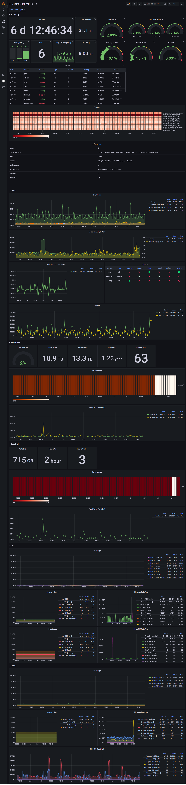

# proxmox-exporter

[README](README.md) | [中文文档](README_CN.md)

proxmox-exporter是一个基于[prometheus](https://prometheus.io/)的导出程序，注意你必须将exporter安装到proxmox的每个节点上他才能工作。

已支持的指标：

* 节点信息
* 节点监控
* 节点温度数据（依赖于sensors命令）
* 节点磁盘数据（smartctl部分数据）
* 虚拟机信息
* 虚拟机监控

查看[metrics](docs/metrics.txt)指标

## 安装

1. 下载[最新](https://github.com/lwch/proxmox-exporter/releases/latest)版本的exporter，并添加执行权限

       sudo chmod +x exporter
2. 根据[示例](https://github.com/lwch/proxmox-exporter/blob/master/conf/exporter.yaml)创建`exporter.yaml`配置文件
3. （可选）从web页面创建token：数据中心 => 权限 => API令牌
4. 修改配置文件中的api.user和api.token配置项
5. 使用以下命令将exporter注册为系统服务

       sudo ./exporter -conf exporter.yaml -action install
6. 使用以下命令启动exporter系统服务

       sudo systemctl start proxmox-exporter

7. 添加prometheus采集节点
8. 导入grafana监控面板，面板ID: 16805

## grafana监控面板

## 已支持版本

目前已测试7.2版本，旧版本请自行测试